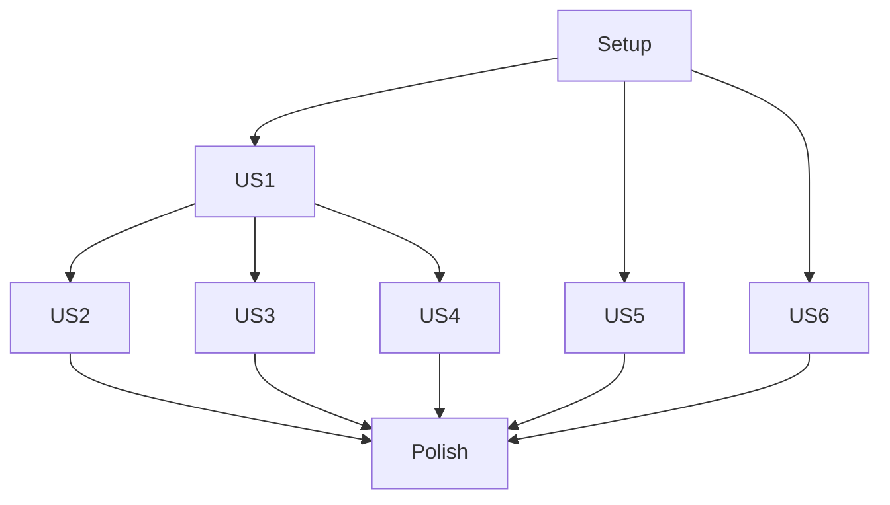

# Tasks: Makefile Build System

**Feature**: `001-makefile-setup`
**Status**: Pending
**Spec**: [specs/001-makefile-setup/spec.md](spec.md)

## Implementation Strategy
- **MVP**: Enable `make build` with versioning (User Story 1).
- **Incremental**: Add testing, linting, and utility targets in priority order.
- **No Dependencies**: This is a standalone build configuration update.

## Dependencies

## Phase 1: Setup & Foundation

**Goal**: Initialize the build system structure.

- [x] T001 Create empty Makefile in project root
- [x] T002 Move `cmd/plugin` to `cmd/finfocus-plugin-azure-public` to match standard and verify `main.go` exists

## Phase 2: User Story 1 - Build Versioned Binary (P1)

**Goal**: Enable binary compilation with injected version information.
**Independent Test**: `make build && ./finfocus-plugin-azure-public --version` displays version.

- [x] T003 [US1] Add `version` variable to `cmd/plugin/main.go` if missing to support LDFLAGS injection
- [x] T004 [US1] Implement logic in `Makefile` to calculate `DEV_VERSION` from git tags
- [x] T005 [US1] Implement `build` target in `Makefile` with `go build -ldflags`
- [x] T006 [US1] Verify `make build` creates binary and `version` flag works

## Phase 3: User Story 2 - Run Test Suite (P2)

**Goal**: Enable concurrent unit testing.
**Independent Test**: `make test` runs with race detection enabled.

- [x] T007 [US2] Implement `test` target in `Makefile` with `-race` and `-v` flags

## Phase 4: User Story 3 - Lint Code (P2)

**Goal**: Enable code quality checks.
**Independent Test**: `make lint` runs golangci-lint with 10m timeout.

- [x] T008 [US3] Create `.golangci.yml` configuration file in project root (or verify existence)
- [x] T009 [US3] Implement `lint` target in `Makefile` running `golangci-lint`

## Phase 5: User Story 4 - Clean Build Artifacts (P3)

**Goal**: cleanup.
**Independent Test**: `make clean` removes the binary.

- [x] T010 [US4] Implement `clean` target in `Makefile` to remove `finfocus-plugin-azure-public`

## Phase 6: User Story 5 - Install Development Tools (P3)

**Goal**: setup dependencies.
**Independent Test**: `make ensure` installs `golangci-lint`.

- [x] T011 [US5] Implement `ensure` target in `Makefile` to install `golangci-lint`

## Phase 7: User Story 6 - View Available Targets (P3)

**Goal**: documentation.
**Independent Test**: `make help` lists all targets.

- [x] T012 [US6] Implement `help` target in `Makefile` to parse and display target comments
- [x] T013 [US6] Set `help` as the default `make` target

## Phase 8: Polish

**Goal**: Final documentation and consistency checks.

- [x] T014 [P] Update `README.md` and `CLAUDE.md` with available make targets and usage instructions
- [x] T015 Run full manual verification sequence: `make clean && make ensure && make build && make test && make lint`
